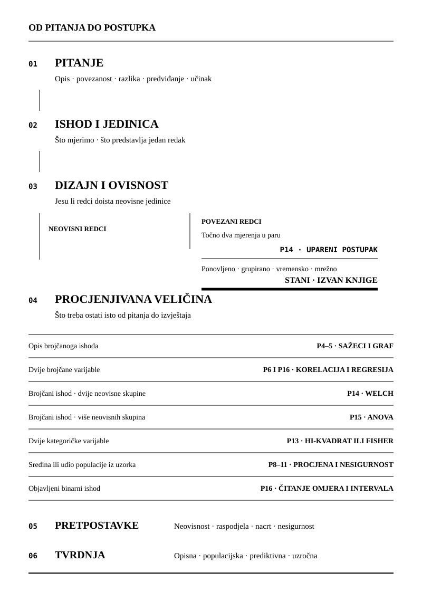

Odabir postupka ne počinje nazivom testa ni vrstom jedne varijable. Počinje
istraživačkim pitanjem, jedinicom koju svaki redak predstavlja i veličinom koju
želimo procijeniti. Tek zatim gledamo vrstu ishoda, raspored skupina ili
prediktora, pretpostavke postupka i doseg tvrdnje. Ovaj dodatak zato nudi
početnu rutu, a ne automatski odgovor.

Stablo ne može popraviti loše mjerenje, izostavljenu populaciju ili pogrešno
spojene retke. Ne može ni stvoriti neovisna opažanja. Ako pitanje i dizajn nisu
jasno zapisani, ispravan je korak zaustaviti izbor postupka i vratiti se
[mjerenju i nacrtu](../chapters/02-mjerenje-i-dizajn.qmd#doseg-zaključka).

## Redoslijed odluka

Šest odluka čuva isti redoslijed u stablu i brzom pregledu. Vrsta ishoda jest
važna, ali sama nikada ne određuje postupak.

| Korak | Odluka koju treba zapisati | Provjera prije nastavka |
|---|---|---|
| Pitanje | opis, povezanost, razlika, predviđanje ili učinak | ista analiza ne služi svim tim tvrdnjama |
| Ishod | brojčana vrijednost, kategorija ili udio | oznaka i jedinica mjere imaju sadržajno značenje |
| Dizajn i ovisnost | neovisne jedinice, dva uparena mjerenja ili složenija veza | redak nije automatski jedinica neovisnosti |
| Procjenjivana veličina | sredina, razlika, udio, povezanost, koeficijent ili pogreška predviđanja | veličina se ne mijenja nakon pogleda na rezultat |
| Pretpostavke | uvjeti uzorkovanja, neovisnosti, raspodjele i nesigurnosti | zamjenski postupak ne popravlja pogrešan dizajn |
| Tvrdnja | opisna, populacijska, prediktivna ili uzročna | zaključak ne prelazi ono što nacrt dopušta |

: Redoslijed odluka prije početnoga postupka. Izrada autora. {#tbl-d-redoslijed}

## Stablo odluke i oporavka

Stablo prikazuje dvije vrste završetka. Tanka ruta vodi do postupka koji knjiga
doista poučava, dok debela crta zaustavljanja znači da treba sačuvati pitanje i
strukturu podataka, ali metodu potražiti izvan ove knjige. Posebna uparena ruta
vrijedi samo kada svaka jedinica nosi točno dva pravilno spojena brojčana
mjerenja.

{#fig-d-stablo fig-alt="Okomito stablo sa šest odluka. Nakon pitanja i vrste ishoda provjerava se ovisnost. Točno dva uparena brojčana mjerenja vode u upareni postupak iz poglavlja 14. Ponovljena, grupirana, longitudinalna, vremenska i mrežno povezana opažanja vode na debelu crtu Stani i izvan knjige. Neovisne jedinice nastavljaju prema opisivanju, povezanosti, usporedbi skupina, kategoričkim tablicama, procjeni iz uzorka ili čitanju objavljenoga binarnog rezultata. Posljednja dva koraka provjeravaju pretpostavke i dopuštenu tvrdnju."}

Rute na donjoj polovini stabla nisu ravnopravne kratice do p-vrijednosti. Opis
raspodjele može biti potpun odgovor bez testa. Usporedba skupina traži procjenu
razlike i interval prije oznake postupka. Kategorička tablica prvo traži
nazivnike i očekivane frekvencije. Svaka inferencijska ruta na kraju se vraća
na [logiku testiranja](../chapters/10-logika-testiranja.qmd#prag-je-konvencija-a-ne-mjera)
i [sadržajnu veličinu](../chapters/11-velicina-ucinka-i-snaga.qmd#razlika-koja-nešto-znači).

## Pravilo ovisnosti

Jedinicu neovisnosti treba moći imenovati jednom rečenicom. Kada svaka osoba,
škola, organizacija, mjesto ili drugi entitet pridonosi jednom međusobno
nevezanom retku, možemo nastaviti prema rutama za neovisne jedinice. Kada ista
jedinica nosi točno dva pravilno spojena brojčana mjerenja, knjiga podupire
usporedbu razlika unutar parova u
[poglavlju o dvjema grupama](../chapters/14-dvije-grupe.qmd#ista-razlika-dva-dizajna).

Svaki širi oblik ovisnosti zaustavlja običnu inferenciju neovisnih redaka. To
vrijedi kada ista osoba ima više od dva mjerenja, kada se opažanja prate kroz
više vremena, kada ljudi dijele kućanstvo, razred, školu, organizaciju ili
mjesto, kada redoslijed kroz vrijeme povezuje susjedna opažanja te kada su
jedinice povezane mrežnim vezama. Welchov postupak, ANOVA, rangiranje i obična
regresija ne uklanjaju tu ovisnost.

Isto pravilo vrijedi za složeni anketni nacrt. Poglavlje o
[nacrtu uzorka](../chapters/08-uzorkovanje.qmd#nacrt-uzorka-i-pristranost-odabira)
uči prepoznati težine, slojeve, skupine, učinak nacrta i efektivnu veličinu
uzorka, ali ne izvodi varijancu složenoga nacrta. Za populacijsku nesigurnost u
takvim podacima treba postupak koji poznaje cijeli nacrt, a takav se postupak u
ovoj knjizi ne poučava.

## Podržane početne rute

Brzi pregled imenuje početni postupak, rezultat koji treba izvući i granicu
koju izvještaj mora sačuvati. Svi redci pretpostavljaju valjano mjerenje i
ispravno određenu jedinicu.

| Pitanje i dizajn | Početni postupak u knjizi | Što izvijestiti | Granica |
|---|---|---|---|
| Opis jedne brojčane varijable | [raspodjela, središte i raspršenost](../chapters/04-sazimanje-podataka.qmd#mjere-središta) uz [prikaz prema tvrdnji](../chapters/05-vizualizacija.qmd#prikaz-prema-tvrdnji) | jedinica, nazivnik, oblik i obranjivi sažeci | opis uzorka nije automatski opis populacije |
| Povezanost dviju brojčanih varijabli na neovisnim jedinicama | [raspršeni dijagram i korelacija](../chapters/06-povezanost.qmd#zajedničko-kretanje), zatim regresija kada pitanje traži uvjetni prosjek | smjer, veličina, interval, populacija i neobična opažanja | povezanost nije uzrok |
| Razlika brojčanoga ishoda između dviju neovisnih skupina | [Welchov t-test](../chapters/14-dvije-grupe.qmd#pretpostavke-i-njihove-granice) | razlika sredina s intervalom, referentna skupina i standardizirana razlika | pripadnost skupini sama ne daje uzročno značenje |
| Promjena brojčanoga ishoda na istim jedinicama izmjerenima točno dvaput | [upareni t-test](../chapters/14-dvije-grupe.qmd#ista-razlika-dva-dizajna) | sredina i interval razlika unutar parova | parovi moraju dolaziti iz dizajna, a ne iz naknadnog slaganja |
| Razlika brojčanoga ishoda između više neovisnih skupina | [ANOVA kao linearni model](../chapters/15-vise-grupa.qmd#granice-pretpostavki) uz unaprijed planirane ili zaštićene usporedbe | ukupna procjena razlika, veličina učinka i intervali imenovanih usporedbi | ukupni test ne govori koja se skupina razlikuje |
| Povezanost dviju kategoričkih varijabli na neovisnim jedinicama | [kontingencijska tablica i hi-kvadrat](../chapters/13-kategoricki-podaci.qmd#očekivano-pod-nezavisnošću), a u maloj tablici s tankom aproksimacijom [Fisherov egzaktni test](../chapters/13-kategoricki-podaci.qmd#kad-je-aproksimacija-tanka) | uvjetni nazivnici, očekivane frekvencije, odstupanja i Cramérovo V | nema jednoga mehaničkog praga koji zamjenjuje pregled tablice |
| Procjena sredine ili udjela populacije iz uzorka | [nacrt uzorka](../chapters/08-uzorkovanje.qmd#populacija-uzorak-i-pogreška-uzorkovanja) i [interval procjene](../chapters/09-procjena.qmd#od-točke-prema-rasponu) | procjena, interval, ciljna populacija, odabir i odaziv | interval slučajnog uzorkovanja ne pokriva sve pristranosti |
| Brojčani ishod s više prediktora na neovisnim jedinicama | [linearna regresija](../chapters/16-regresija.qmd#pravac-kao-tvrdnja-o-prosjeku) | koeficijenti s intervalima, referentne vrijednosti, pristajanje i dijagnostika | prilagodba nije uzročna identifikacija |
| Čitanje objavljenoga rezultata za binarni ishod | [ishod, referentna skupina, omjer izgleda i interval](../chapters/16-regresija.qmd#granica-prema-uzroku), bez prilagodbe modela | što je uspoređeno, mjera, interval, prilagodbe i populacija | knjiga ne prilagođava ni dijagnosticira logistički model |

: Početne rute koje knjiga podupire te njihovi rezultati i granice. Izrada autora. {#tbl-d-podrzane-rute}

## Kad knjiga nema postupak

Zaustavljanje nije odustajanje od analize. Ono sprečava da se uredan ispis
dobije iz pogrešne jedinice ili tvrdnje. Prije izlaska iz knjige treba zapisati
istraživačko pitanje, ishod, jedinicu, način povezivanja redaka, vrijeme
mjerenja, ciljnu populaciju i procjenjivanu veličinu. S tim zapisom čitatelj se
obraća nastavniku, statističkom metodologu ili provjerenom izvoru za upravo taj
nacrt prije nego što odabere softver ili postupak.

| Znak da treba stati | Što knjiga ipak pomaže pročitati | Ruta izvan knjige |
|---|---|---|
| Više mjerenja iste jedinice, longitudinalno praćenje ili drugi ponovljeni redci | jedinicu i vezu među redcima | tražiti postupak koji čuva sva ponavljanja i njihovu vremensku strukturu |
| Učenici u razredima, članovi kućanstava, ustanove u mjestima ili druga grupirana i ugniježđena opažanja | razinu na kojoj nastaje varijacija | tražiti postupak koji u nesigurnosti čuva grupiranje i sve razine nacrta |
| Vremenski niz ili opažanja čiji redoslijed povezuje susjedne vrijednosti | ishod, razmak mjerenja i cilj predviđanja ili opisa | tražiti postupak koji izričito čuva vremensku ovisnost |
| Osobe, organizacije ili sadržaji povezani mrežnim vezama | čvor, vezu i granicu promatrane mreže | tražiti postupak koji mrežne veze ne tretira kao neovisne retke |
| Anketna procjena s težinama, slojevima ili skupinama za koju treba standardna pogreška | [učinak nacrta i efektivnu veličinu uzorka](../chapters/08-uzorkovanje.qmd#nacrt-uzorka-i-pristranost-odabira) | tražiti postupak i dokumentaciju koji koriste puni anketni nacrt |
| Procjenjivanje modela za binarni ishod | [čitanje omjera izgleda i intervala](../chapters/16-regresija.qmd#granica-prema-uzroku) | za prilagodbu i dijagnostiku modela tražiti metodu izvan opsega knjige |
| Procjena uzročnoga učinka iz opažajnih podataka | [dizajn i doseg zaključka](../chapters/02-mjerenje-i-dizajn.qmd#doseg-zaključka) te [granica prilagodbe](../chapters/16-regresija.qmd#granica-prema-uzroku) | tražiti nacrt i identifikacijsku strategiju prije izbora procjenitelja |
| Računska sinteza rezultata više studija | [čitanje replikacijskih procjena i forest plota](../chapters/12-kriza-i-obnova.qmd#cijeli-zapis-u-forest-plotu) | za meta-analitičku procjenu i njezine pretpostavke tražiti metodu izvan opsega knjige |

: Obrasci za koje knjiga nudi prepoznavanje i čitanje, ali ne i postupak procjene. Izrada autora. {#tbl-d-izvan-knjige}

## Provjera nakon izbora

Naziv postupka ne zatvara analizu. Treba pregledati jedinice, nedostajuće
vrijednosti, raspodjele, reziduale, očekivane frekvencije, skupne varijance i
način uzorkovanja ondje gdje su primjenjivi. Procjena, interval i sadržajna
veličina dolaze prije odluke o testu, a svaka osjetljivost mora odgovoriti na
imenovanu sumnju, ne samo ponuditi drukčiju p-vrijednost.

Posljednja provjera vraća nas pitanju. Opisna ruta dopušta opis podataka koje
imamo. Populacijska ruta traži nacrt uzorka i nesigurnost koja mu odgovara.
Prediktivna ruta traži podatke odvojene od procjene i istu vremensku granicu u
učenju i primjeni. Uzročna rečenica traži dizajn i pretpostavke koje sam naziv
testa ne može dati. Ako nijedna ruta u ovom dodatku ne čuva tu razliku, metoda
se ne bira iz knjige.
